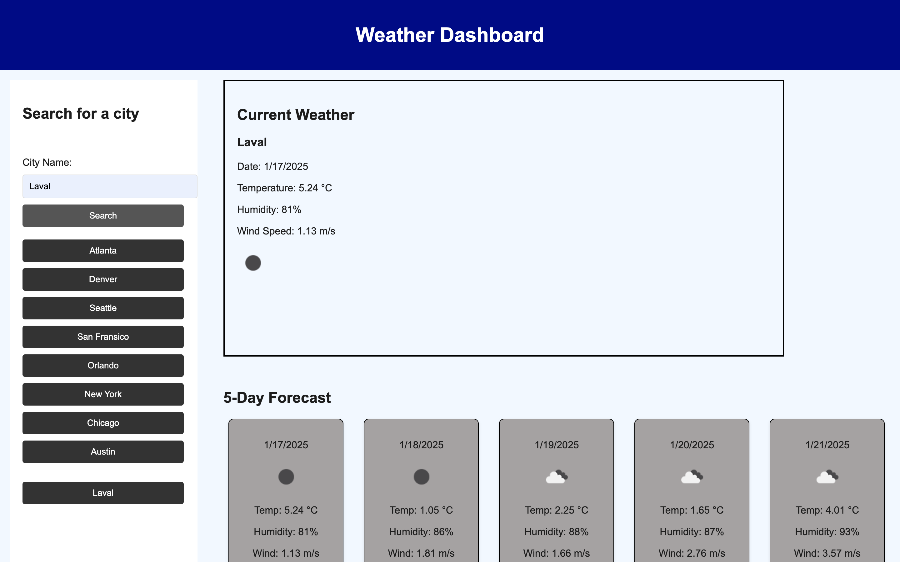

# challenge-6
Weather Dashboard

This Weather Dashboard is a simple web application that allows users to search for weather data by city. It displays the current weather and a 5-day forecast, complete with temperature, humidity, wind speed, and weather icons.

Table of Contents
	•	Description
	•	Features
	•	Technologies Used
	•	Setup and Installation
	•	Usage
	•	Screenshots
	•	License

Description

The Weather Dashboard provides travelers and users with a quick way to check current and future weather conditions for cities around the world. By leveraging the OpenWeather API, the app dynamically updates the weather data and allows users to access previously searched cities through search history.

Features
	•	Search weather data by city name.
	•	Displays current weather conditions, including:
	•	Temperature
	•	Humidity
	•	Wind speed
	•	Weather icon
	•	Provides a 5-day weather forecast for the selected city.
	•	Saves search history in localStorage for quick access to previously searched cities.
	•	Responsive design that works on desktop and mobile devices.

Technologies Used
	•	HTML5
	•	CSS3
	•	JavaScript (ES6+)
	•	OpenWeather API

Setup and Installation

To run the project locally, follow these steps:
	1.	Clone the repository:

git clone https://github.com/Dory509/challenge-6.git

	2.	Set up your API Key:
	•	Create an account on OpenWeather to obtain an API key.
	•	Replace your_api_key in the script.js file with your actual API key:

const apiKey ="46ad213be7910ff3f778ae802a5450f5"; 
 <!-- //api.openweathermap.org/data/2.5/forecast?lat={lat}&lon={lon}&appid={API key} --> 

	3.	Run the application:
	•	Open index.html in your web browser to use the app.

Usage
	1.	Enter the name of a city in the search bar and click “Search.”
	2.	View the current weather conditions and a 5-day forecast for the selected city.
	3.	Click on any city in the search history to quickly retrieve its weather data.

Screenshots

Search Weather by City

Current Weather and Forecast

Future Improvements
	•	Add functionality to remove specific cities from the search history.
	•	Enhance error handling for invalid city names or API failures.
	•	Implement additional metrics like UV Index and Air Quality.

License

This project is licensed under the MIT License. See the LICENSE file for details.

Acknowledgments
	•	OpenWeather API for providing weather data.
	•	Coding Bootcamp for inspiration and guidance on the project.

